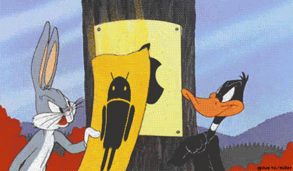

  

Hakkımda

⚙️ Web + Mobil: Flutter/React, küçük MVP'ler ve otomasyon meraklısı

🛒 E‑ticaret/Dropshipping: Ürün araştırma, reklam ve analitik

🧠 AI / Otomasyon: N8N ile iş akışları, scriptler

“Basit başla, hızlı gönder, veriye göre tekrar et.”

Öne Çıkan Projeler

🎬 filmbul.com – Film/dizi arşivi

🛠️ sonvites.net – Araç tutkunlarına sanal garaj uygulaması (WIP)

💬 AI Dating (MVP) – Flutter + Firebase + basit eşleştirme (plan)

İletişim

📫 Mail: hello@berkaysahin.com

🌐 Site: berkaysahin.com

💼 LinkedIn: /in/berkay--sahin

  <!-- Skillicons.dev kısmı -->
  

  <!-- Manuel eklenen özel ikonlar -->
  
  
  

